# LLM Autonomy Levels - Flowcharts

This file contains all the Mermaid flowcharts for visualizing LLM autonomy levels.

## Level 0: Direct Code (0% Autonomy)

```mermaid
graph TD
    A["🏁 User Input"] --> B{Level 0: Direct Code}
    B --> C["if/else Logic"]
    C --> D["Deterministic Output"]
    D --> E["✅ Predictable Result"]
    
    style A fill:#e1f5fe
    style B fill:#f3e5f5
    style C fill:#fff3e0
    style D fill:#e8f5e8
    style E fill:#e8f5e8
```

## Level 1: Single LLM Call (20% Autonomy)

```mermaid
graph TD
    A["🏁 User Input"] --> B["System Prompt"]
    B --> C["🤖 Single LLM Call"]
    C --> D["Generated Response"]
    D --> E["✅ Output"]
    
    style A fill:#e1f5fe
    style B fill:#fff3e0
    style C fill:#f3e5f5
    style D fill:#fff3e0
    style E fill:#e8f5e8
```

## Level 2: Chains (40% Autonomy)

```mermaid
graph TD
    A["🏁 User Input"] --> B["🤖 LLM Call 1<br/>Query Generation"]
    B --> C["🔧 Tool Execution<br/>Search/Process"]
    C --> D["🤖 LLM Call 2<br/>Analysis"]
    D --> E["🤖 LLM Call 3<br/>Synthesis"]
    E --> F["✅ Final Output"]
    
    style A fill:#e1f5fe
    style B fill:#f3e5f5
    style C fill:#fff3e0
    style D fill:#f3e5f5
    style E fill:#f3e5f5
    style F fill:#e8f5e8
```

## Level 3: Routers (60% Autonomy)

```mermaid
graph TD
    A["🏁 User Input"] --> B["🤖 Router LLM<br/>Classify Intent"]
    
    B --> C{Route Decision}
    C -->|Weather| D["🌤️ Weather Chain"]
    C -->|Math| E["🔢 Math Chain"]
    C -->|General| F["💬 Chat Chain"]
    C -->|Unknown| G["❓ Fallback Chain"]
    
    D --> H["✅ Weather Response"]
    E --> I["✅ Math Response"]
    F --> J["✅ Chat Response"]
    G --> K["✅ Fallback Response"]
    
    style A fill:#e1f5fe
    style B fill:#f3e5f5
    style C fill:#fff3e0
    style D fill:#e3f2fd
    style E fill:#e8f5e8
    style F fill:#fce4ec
    style G fill:#fff9c4
```

## Level 4: State Machines/Agents (80% Autonomy)

```mermaid
graph TD
    A["🏁 Goal/Query"] --> B["🧠 Agent Reasoning<br/>Plan Next Action"]
    
    B --> C{Action Decision}
    C -->|Need Info| D["🔧 Use Tool<br/>(Search, Calculate, etc.)"]
    C -->|Need Analysis| E["🤖 LLM Processing<br/>(Analyze, Summarize)"]
    C -->|Complete| F["✅ Final Answer"]
    
    D --> G["📊 Tool Result"]
    E --> H["💭 LLM Output"]
    
    G --> I["📝 Update State<br/>Add to Memory"]
    H --> I
    
    I --> J{Goal Achieved?}
    J -->|No| B
    J -->|Yes| F
    J -->|Max Iterations| K["⚠️ Timeout/Error"]
    
    style A fill:#e1f5fe
    style B fill:#f3e5f5
    style C fill:#fff3e0
    style D fill:#e3f2fd
    style E fill:#f3e5f5
    style F fill:#e8f5e8
    style I fill:#fff9c4
    style J fill:#fce4ec
    style K fill:#ffebee
```

## Level 5: Autonomous Agents (95%+ Autonomy)

```mermaid
graph TD
    A["🎯 Self-Set Goals"] --> B["🧠 Strategic Planning<br/>Long-term Strategy"]
    
    B --> C["📋 Task Breakdown<br/>Sub-goals Creation"]
    C --> D["🔄 Execution Loop"]
    
    D --> E{Select Action}
    E -->|Research| F["🔍 Information Gathering"]
    E -->|Create| G["⚒️ Content/Code Generation"]
    E -->|Analyze| H["📊 Data Analysis"]
    E -->|Communicate| I["💬 External Communication"]
    E -->|Learn| J["📚 Skill Development"]
    
    F --> K["💾 Long-term Memory<br/>Experience Storage"]
    G --> K
    H --> K
    I --> K
    J --> K
    
    K --> L{Goal Progress Check}
    L -->|Continue| M["🔄 Adapt & Replan"]
    L -->|Goal Complete| N["🎯 Set New Goals"]
    L -->|Goal Obsolete| O["🗑️ Abandon Goal"]
    
    M --> D
    N --> A
    O --> A
    
    style A fill:#e1f5fe
    style B fill:#f3e5f5
    style C fill:#fff3e0
    style D fill:#fce4ec
    style K fill:#fff9c4
    style L fill:#e8f5e8
    style M fill:#ffebee
    style N fill:#e1f5fe
    style O fill:#ffebee
```

## Autonomy Progression Overview

## How to Use These Diagrams

### Option 1: Copy-Paste into Markdown
Copy any of the code blocks above and paste them into any Markdown file or documentation that supports Mermaid.

### Option 2: Online Mermaid Editors
- **Mermaid Live Editor**: https://mermaid.live/
- **Draw.io**: Supports Mermaid import
- **GitHub/GitLab**: Renders Mermaid in README files

### Option 3: Generate Images
Use tools like:
- **mermaid-cli**: `mmdc -i diagram.mmd -o diagram.png`
- **Online converters**: Convert Mermaid to PNG/SVG

### Option 4: Include in Documentation
Most modern documentation platforms (GitHub, GitLab, Notion, etc.) support Mermaid rendering directly.
